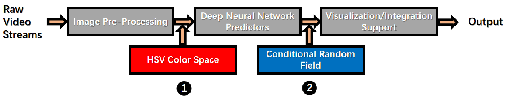
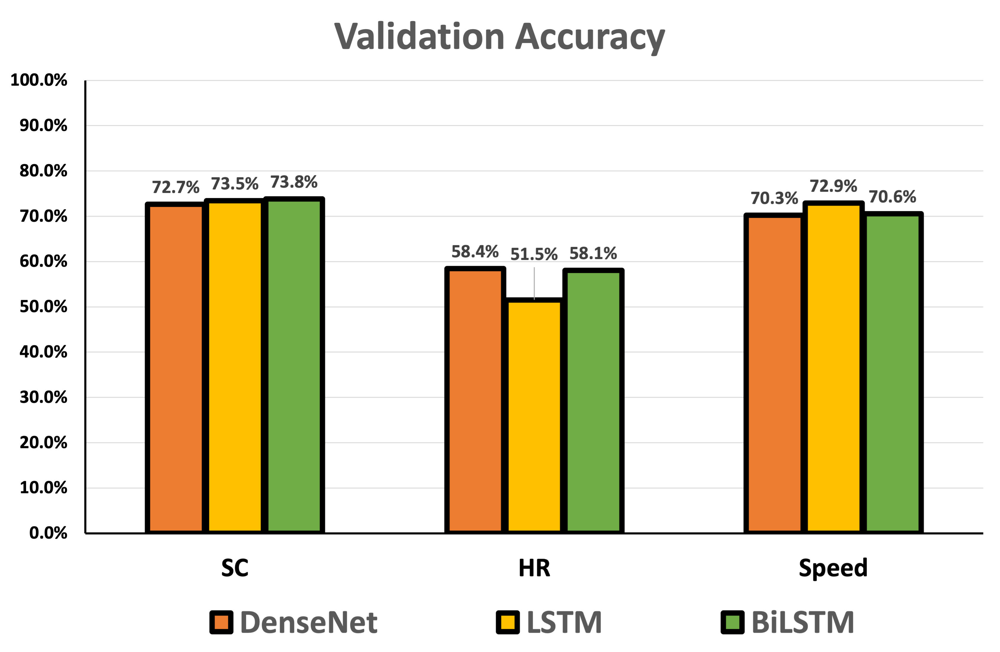
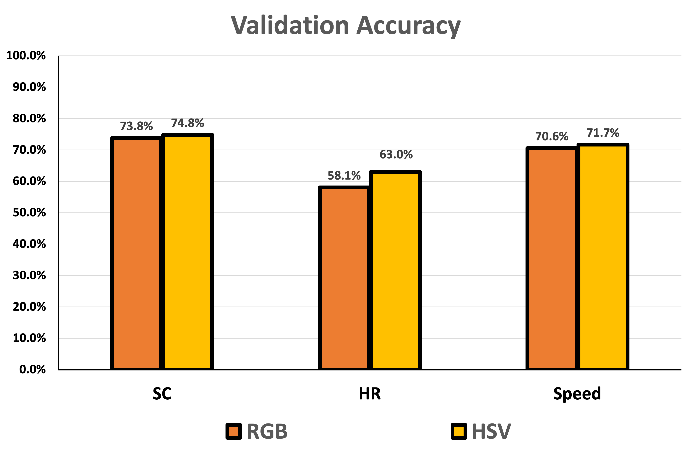
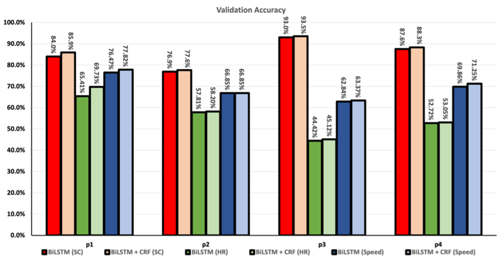

# Face2Statistics
A comprehensive roadmap to deliver user-friendly, low-cost and effective alternatives for extracting drivers’  statistics. Full paper is accepted by HCII'22.

The WIP version is [here](https://github.com/unnc-ucc/Face2Multimodal).

=======
**Procedure**

Input

Raw video streams (facial expressions contains many noisy pixels)

Step1

Pre-processing input images to retrieve only the facial expressions and enhance the performance of Face2Statistics

Step2

Exploring different deep neural network-driven predictors

  First Attempt: Convolution Neural Networks (CNNs) 

  Second Attempt: Long Short-Term Memory (LSTM) Recurrent Neural Network (RNN) 

  Third Attempt: Bidirectional Long-Short-Term Memory (BiLSTM) Recurrent Neural Network (RNN)

Step3

Visualizing predicted result

Output

Two optimization

a) We utilize HSV color space instead of RGB color space to reduce the variance of illumination among different pixels.

b) We apply personalized parameters via pearson correlation coefficients to conditional random field to realize customizing.

**Experiment Results**

a) Comparisons among Different Neural Network Models

 The results of training and validation accuracy, in terms of DenseNet, LSTM and BiLSTM are displayed as follows.

.png)

b) Comparisons between Different Color Models

The results of training and validation accuracy, in terms of RGB and HSV are displayed as follows.

.png)

c) Comparisons between Models w/ or w/out CRF

The results of s the comparative validation accuracy of BiLSTM w/ and w/out CRF support for four different drivers are displayed as follows.

**Contributor**

Zeyu Xiong, Jiahao Wang, Wangkai Jin, Junyu Liu, Yicun Duan, Zilin Song, Xiangjun Peng

=========================
Qidan Chen: I read some paper and these can be considered for personalized customization.
            1)personalized thresholding method.
            Samuel Spaulding, Cynthia Breazeal:
            Frustratingly Easy Personalization for Real-time Affect Interpretation of Facial Expression. ACII 2019: 531-537

            dynamically calculating and apply a personalized threshold for determining affect feature labels over time
            the personalized thresholding method does not preclude other methods of personalization, and is incredibly simple, easy to run in real-time, and does not require re-training a complex model as new data is sensed.
            https://ieeexplore-ieee-org.ezproxy.nottingham.edu.cn/stamp/stamp.jsp?tp=&arnumber=8925515

            2)transductive parameter transfer approach
            Zen, Gloria ; Porzi, Lorenzo ; Sangineto, Enver ; Ricci, Elisa ; Sebe, Nicu:
            Learning Personalized Models for Facial Expression Analysis and Gesture Recognition

            this paper presents a framework for personalizing classification models which does not require labeled target data. Personalization is achieved by devising a novel transfer learning approach.
            https://ieeexplore-ieee-org.ezproxy.nottingham.edu.cn/stamp/stamp.jsp?tp=&arnumber=7394167

            3)transductive learning method
            Chu, Wen-Sheng ; De la Torre, Fernando ; Cohn, Jeffrey F:
            Selective Transfer Machine for Personalized Facial Expression Analysis
            We propose a transductive learning method, which we refer to as a Selective Transfer Machine (STM), to personalize a generic classifier by attenuating person-specific mismatches.
            https://ieeexplore-ieee-org.ezproxy.nottingham.edu.cn/stamp/stamp.jsp?tp=&arnumber=7442563

            

            